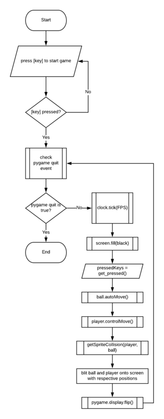

# brick-breaker

This program is a simple remake of the classic Atari Breakout game. It's
made using the pygame module, and object oriented programming in python.

## Overview

### UML


### Flowchart



### Features

## Getting Started

These instructions *should* get you a copy of the project up and running
on your local machine. This is usually just for development and testing,
but we have no deployment strategies, so have at it.

#### Prerequisites

- [Python 3.6.1 +](https://www.python.org/downloads/)
- [Pygame 1.9.4 +](https://www.pygame.org/download.shtml)

#### Installation & Usage

```
# Clone the repository (stable branch)
git clone -b master https://git.mikezhang.ca/z.hooda/brick-breaker.git
# OR download zip file from BIG GREEN BUTTON

# Go to the project directory
cd ~/brick-breaker

# Run main script
python3 main.py

# Eat something to replenish your strength
# Cloning git repos takes a lot of energy
```

## Built With

- [Atom](https://atom.io) - The superior text editor

## Contributors
- Mr. Mike Zhang - File Reading Functions
- Dhiraj Meenavilli - Debugging & Mental Support

## Author
- Zeeshan Hooda